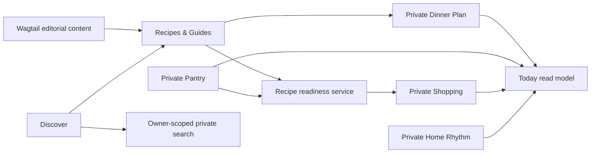

# DomoNest

[](https://github.com/MykolaDotsenko/wagtail-StreamField/actions/workflows/ci.yml)


**DomoNest** is a production-minded Django + Wagtail household operating system designed to reduce everyday mental load.

> **Less to remember. More room to live.**

It started as a small Wagtail StreamField exercise and evolved into a cohesive portfolio case study built around connected household workflows, explicit domain invariants and production-quality verification rather than isolated CRUD screens.

## Product loop

```text
Recipe → Pantry readiness → Missing / low ingredients → Shopping
Recipe → Plan dinner → Today
Pantry low stock → Shopping
Routine → Complete / skip / postpone → Next recurrence
Discover → Public knowledge + owner-scoped private state
```

### Real CI browser evidence

These screenshots are produced by the same Chromium golden journey that runs in CI; they are not mockups.

| Today | Recipe readiness |
| --- | --- |
|  |  |


### Product surfaces

- **Today** — deterministic next-action feed, not a vanity dashboard.
- **Plan** — one dinner per day with Pantry-aware recipe readiness.
- **Shopping** — mobile-first Quick Add, category grouping, buy/reopen, Shopping mode and Undo.
- **Pantry** — low-maintenance approximate or precise stock tracking with expiry attention.
- **Home Rhythm** — recurring routines with immutable completion/skip/postpone history.
- **Recipes** — structured Wagtail recipe authoring with canonical ingredients.
- **Guides** — constrained actionable Wagtail content blocks.
- **Discover** — grouped public search plus clearly separated owner-scoped private search.

## Why this project is technically interesting

DomoNest is intentionally small enough to understand in one repository, while still exercising production concerns that matter in real systems:

- database-enforced domain invariants rather than form-only validation;
- owner-scoped private queries at the point of retrieval;
- idempotent cross-module commands;
- deterministic recurrence and ingredient reconciliation;
- derived read models instead of duplicated dashboard state;
- Wagtail editorial content separated from private transactional state;
- PostgreSQL integration testing alongside zero-setup SQLite development;
- query-budget regression tests for high-value read models;
- browser-level golden journey and automated WCAG 2.2 AA checks.

## Stack

- Python 3.12–3.14
- Django 5.2.17
- Wagtail 7.4.3
- PostgreSQL production target; SQLite for zero-setup development
- Gunicorn
- WhiteNoise for fingerprinted static assets
- Server-rendered HTML/CSS with progressive enhancement
- Playwright + Chromium browser E2E
- Axe WCAG 2.2 AA automated smoke checks
- Ruff, Coverage and pip-audit

No SPA framework, AI layer or search cluster is added without a product requirement.

## Architecture



DomoNest deliberately separates responsibilities:

- **Wagtail** owns public/editorial content, publishing, snippets and structured authoring.
- **Django domain models/services** own private transactional household state and invariants.
- **Selectors/read models** compose Today, Plan, readiness and Discover state.
- **Views** orchestrate authentication, forms, services and response rendering.
- **Templates** render already-understood state; they do not contain domain rules.

Important properties include owner-scoped private queries, database constraints, idempotent Recipe → Shopping writes, conservative ingredient reconciliation and derived—not duplicated—readiness state.

## Run locally

Create a virtual environment, then:

```bash
python -m pip install -r requirements-dev.txt
python manage.py migrate
python manage.py seed_demo --reset --username demo --password domonest-demo
python manage.py runserver
```

Open `http://127.0.0.1:8000/`.

Demo account:

```text
username: demo
password: domonest-demo
```

The demo password is intentionally local-only. Do not reuse it for a deployed environment.

## Verified quality gates

The integrated release was verified in **CI run #91** on the exact release-verification head.

| Gate | Evidence |
| --- | --- |
| Python compatibility | 3.12 ✅ · 3.13 ✅ · 3.14 ✅ |
| Django / Wagtail checks | ✅ |
| Migration drift | 0 ✅ |
| Branch coverage threshold | ≥ 80% ✅ |
| PostgreSQL full suite | ✅ |
| Production `check --deploy` | ✅ |
| Production `collectstatic` | ✅ |
| Python dependency audit | ✅ |
| Browser dependency audit | ✅ |
| Chromium golden journey | ✅ |
| Axe WCAG A/AA smoke gate | ✅ |

Browser runs publish Playwright reports, traces/failure screenshots and portfolio-oriented screenshots as the **domonest-browser-evidence** workflow artifact.

See **[Release evidence](./docs/12_RELEASE_EVIDENCE.md)** for the exact verification contract.

## Production baseline

Copy `.env.example`, use `mysite.settings.production`, configure PostgreSQL and persistent media storage, then:

```bash
python manage.py check --deploy
python manage.py migrate --noinput
python manage.py collectstatic --noinput
gunicorn mysite.wsgi:application --bind 0.0.0.0:${PORT:-8000}
```

Read the full [deployment runbook](./docs/11_DEPLOYMENT_RUNBOOK.md).

Health/readiness endpoint:

```text
GET /health/
```

## Engineering handbook

Start with **[docs/00_INDEX.md](./docs/00_INDEX.md)**.

Key documents:

- [Product specification](./docs/01_PRODUCT_SPEC.md)
- [UX research and flows](./docs/02_UX_RESEARCH_AND_FLOWS.md)
- [UI design system](./docs/03_UI_DESIGN_SYSTEM.md)
- [Architecture](./docs/04_ARCHITECTURE.md)
- [Domain model](./docs/05_DOMAIN_MODEL.md)
- [Quality, security and accessibility](./docs/06_QUALITY_SECURITY_ACCESSIBILITY.md)
- [Implementation roadmap](./docs/07_IMPLEMENTATION_ROADMAP.md)
- [Official references](./docs/08_REFERENCE.md)
- [Architecture decisions](./docs/09_ADR_LOG.md)
- [Research log](./docs/10_RESEARCH_LOG.md)
- [Deployment runbook](./docs/11_DEPLOYMENT_RUNBOOK.md)
- [Release evidence](./docs/12_RELEASE_EVIDENCE.md)

## Delivery history

The product was rebuilt as bounded vertical slices:

1. foundation and CI;
2. design system / app shell;
3. Shopping;
4. Pantry;
5. recurring Home Rhythm;
6. Today;
7. Wagtail content architecture;
8. Recipe domain;
9. Recipe → Pantry → Shopping;
10. dinner planning;
11. Discover/search;
12. production hardening;
13. release / portfolio evidence.

See the roadmap for detailed acceptance criteria and rationale.
