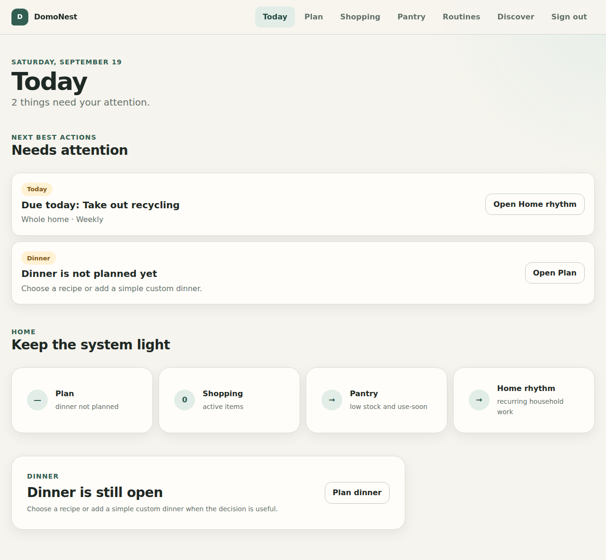

# DomoNest

**A production-minded Django + Wagtail household operating system that turns everyday home maintenance into a small set of useful next actions.**

> **Less to remember. More room to live.**

DomoNest started as a Wagtail StreamField exercise and evolved into a connected portfolio product: meal planning understands Pantry readiness, missing recipe ingredients become Shopping demand, recurring household work advances deterministically, and Today composes the most useful actions without duplicating domain state.



> Screenshot generated from the real Django/Wagtail application with deterministic demo data in Chromium — not a design mockup.

## Why this project is different

Many portfolio apps stop at independent CRUD screens. DomoNest is built around **cross-domain workflows and explicit invariants**:

```text
Recipe → Pantry readiness → Missing / low ingredients → Shopping
Recipe → Plan dinner → Today
Pantry low stock → Shopping
Routine → Complete / skip / postpone → Next recurrence
Discover → Public Wagtail knowledge + owner-scoped private household state
```

The product goal is simple: **reduce household mental load without making the user maintain another complicated system.**

## Product surfaces

| Surface | What it does | Engineering signal |
| --- | --- | --- |
| **Today** | Deterministic next-best-action feed | Derived read model; no duplicated dashboard state |
| **Plan** | One dinner per day with recipe readiness | Date-scoped planning + Pantry-aware reconciliation |
| **Shopping** | Quick Add, grouping, buy/reopen, Undo, focused Shopping mode | DB invariants, idempotent writes, owner-scoped mutations |
| **Pantry** | Approximate or precise stock with expiry attention | Low-maintenance domain model + derived attention states |
| **Home Rhythm** | Recurring household routines | Immutable event history + deterministic recurrence |
| **Recipes** | Structured editorial recipes | Wagtail Page + snippets + relational ingredients |
| **Guides** | Actionable household knowledge | Constrained StreamField authoring system |
| **Discover** | Public knowledge + private household search | Explicit public/private search boundary |

## Architecture at a glance

DomoNest deliberately separates editorial content from private transactional state:

- **Wagtail** owns public pages, publishing, snippets and structured authoring.
- **Django domain models + services** own private household state and write invariants.
- **Selectors / read models** compose Today, Plan, recipe readiness and Discover.
- **Views** orchestrate authentication, forms, services and responses.
- **Templates** render already-understood state; they do not contain business rules.
- **Database constraints** protect invariants that must survive UI or retry failures.

Key decisions include:

- conservative normalized identity instead of fuzzy/AI matching;
- explicit `AVAILABLE / LOW / MISSING / UNKNOWN` recipe readiness;
- idempotent Recipe/Pantry → Shopping writes;
- owner scoping at query time;
- immutable Routine event history;
- public Wagtail search kept separate from private household queries;
- server-rendered UI with progressive enhancement rather than SPA complexity.

## Stack

- **Python 3.12–3.14**
- **Django 5.2.17**
- **Wagtail 7.4.3**
- **PostgreSQL** production/integration target
- SQLite for zero-setup local development
- **Gunicorn**
- **WhiteNoise** with fingerprinted production static assets
- Server-rendered HTML + CSS
- **Playwright + Chromium**
- **Axe WCAG 2.2 AA** automated browser checks
- **Ruff**, Coverage and `pip-audit`

No SPA framework, AI layer or search cluster is added unless a product requirement justifies the operational cost.

## Quality evidence

CI verifies the repository across multiple layers:

- Python **3.12 / 3.13 / 3.14**;
- Ruff lint + formatting;
- Django/Wagtail system checks;
- migration drift;
- clean database migrations;
- branch coverage threshold;
- full PostgreSQL integration suite;
- production `check --deploy`;
- production `collectstatic`;
- Python dependency audit;
- Chromium golden journey;
- Axe accessibility checks;
- cross-module workflow regression scenarios;
- query-budget regressions for high-value read models.

Browser CI publishes Playwright evidence including desktop/mobile screenshots, traces and failure artifacts.

## Run the exact demo locally

Create a virtual environment, then:

```bash
python -m pip install -r requirements-dev.txt
python manage.py migrate
python manage.py seed_demo --reset --username demo --password domonest-demo
python manage.py runserver
```

Open:

```text
http://127.0.0.1:8000/
```

Demo account:

```text
username: demo
password: domonest-demo
```

The demo password is intentionally local-only. Do not reuse it in a deployed environment.

### Re-render the README screenshot

After installing browser dependencies:

```bash
npm install --no-audit --no-fund
npx playwright install chromium
python manage.py migrate
python manage.py seed_demo --reset --username demo --password domonest-demo
python manage.py runserver 127.0.0.1:8000 --noreload
```

In another terminal:

```bash
node scripts/capture-readme-screenshot.mjs
```

The script writes the real rendered UI to:

```text
docs/images/domonest-today.png
```

## Production baseline

Copy `.env.example`, use `mysite.settings.production`, configure PostgreSQL and persistent media storage, then:

```bash
python manage.py check --deploy
python manage.py migrate --noinput
python manage.py collectstatic --noinput
gunicorn mysite.wsgi:application --bind 0.0.0.0:${PORT:-8000}
```

Health/readiness endpoint:

```text
GET /health/
```

See the full [deployment runbook](./docs/11_DEPLOYMENT_RUNBOOK.md).

## Engineering handbook

The repository keeps product and engineering decisions explicit instead of hiding them in implementation history.

Start with **[docs/00_INDEX.md](./docs/00_INDEX.md)**.

- [Product specification](./docs/01_PRODUCT_SPEC.md)
- [UX research and flows](./docs/02_UX_RESEARCH_AND_FLOWS.md)
- [UI design system](./docs/03_UI_DESIGN_SYSTEM.md)
- [Architecture](./docs/04_ARCHITECTURE.md)
- [Domain model](./docs/05_DOMAIN_MODEL.md)
- [Quality, security and accessibility](./docs/06_QUALITY_SECURITY_ACCESSIBILITY.md)
- [Implementation roadmap](./docs/07_IMPLEMENTATION_ROADMAP.md)
- [Official references](./docs/08_REFERENCE.md)
- [Architecture decisions](./docs/09_ADR_LOG.md)
- [Research log](./docs/10_RESEARCH_LOG.md)
- [Deployment runbook](./docs/11_DEPLOYMENT_RUNBOOK.md)

## Delivery history

DomoNest was rebuilt as bounded vertical slices:

1. foundation + CI;
2. design system + app shell;
3. Shopping;
4. Pantry;
5. recurring Home Rhythm;
6. Today orchestration;
7. Wagtail content architecture;
8. Recipe domain;
9. Recipe → Pantry → Shopping;
10. dinner planning;
11. privacy-safe Discover/search;
12. production hardening;
13. cross-module browser regression scenarios.

Each slice was designed around product value, domain invariants, accessibility and testability rather than feature count.
